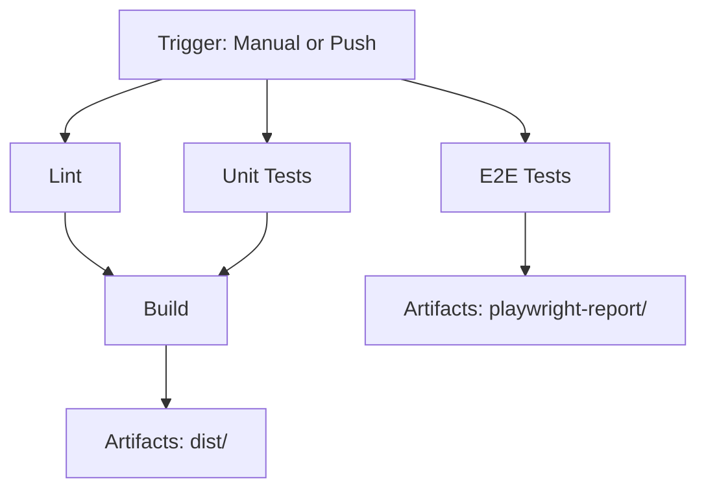

# CI/CD Architecture

## Workflow Diagram

```
┌─────────────────────────────────────────────────────────────┐
│                    CI/CD Pipeline Trigger                    │
│                                                               │
│  • Manual (workflow_dispatch)                                │
│  • Push to main/master                                       │
└─────────────────────────────────────────────────────────────┘
                            │
                            ▼
        ┌───────────────────────────────────────┐
        │                                       │
        ▼                                       ▼
┌───────────────┐                    ┌──────────────────┐
│   Lint Job    │                    │  Unit Tests Job  │
│               │                    │                  │
│ • ESLint      │                    │ • Vitest         │
│ • ~1-2 min    │                    │ • MSW mocking    │
│               │                    │ • ~2-3 min       │
└───────────────┘                    └──────────────────┘
        │                                       │
        │                                       │
        └───────────────┬───────────────────────┘
                        │
                        │ (needs: lint, unit-tests)
                        ▼
                ┌───────────────┐
                │  Build Job    │
                │               │
                │ • Astro build │
                │ • Production  │
                │ • ~2-3 min    │
                │               │
                │ Artifacts:    │
                │ • dist/       │
                └───────────────┘

        ┌────────────────────────────┐
        │    E2E Tests Job           │
        │    (parallel, independent) │
        │                            │
        │ • Playwright               │
        │ • Chromium only            │
        │ • Requires secrets         │
        │ • ~3-5 min                 │
        │                            │
        │ Artifacts:                 │
        │ • playwright-report/       │
        └────────────────────────────┘
```

## Job Dependencies



## Execution Flow

### Phase 1: Parallel Execution (Independent Jobs)
- **Lint** - Runs independently
- **Unit Tests** - Runs independently
- **E2E Tests** - Runs independently

**Duration:** ~3-5 minutes (longest job determines phase time)

### Phase 2: Build (Dependent Job)
- **Build** - Waits for Lint and Unit Tests to complete
- Only runs if both Lint and Unit Tests pass

**Duration:** ~2-3 minutes

### Total Time
**~5-8 minutes** for successful run (all jobs pass)

## Resource Requirements

### Secrets (GitHub Repository Secrets)
```yaml
Required for E2E Tests & Build:
  - SUPABASE_URL
  - SUPABASE_KEY
  - OPENROUTER_API_KEY

Not required for Lint & Unit Tests:
  - (use MSW mocking instead)
```

### Compute Resources
- **Runner:** `ubuntu-latest` (GitHub-hosted)
- **Node.js:** 22.20.0 (from `.nvmrc`)
- **Browsers:** Chromium only (Playwright)
- **Cache:** npm dependencies cached

### Artifacts Storage
- **playwright-report/**: 7 days retention
- **dist/**: 7 days retention

## Design Decisions

### ✅ Why separate Lint, Unit Tests, and Build?

**Fail Fast Strategy:**
- If linting fails → no need to run tests or build
- If unit tests fail → no need to build
- Saves CI/CD minutes and provides faster feedback

### ✅ Why E2E Tests run in parallel?

**Independence:**
- E2E tests don't affect build artifacts
- Can run simultaneously with other jobs
- Provides faster overall pipeline execution

**Trade-off:**
- E2E failures don't block build
- Build can succeed even if E2E fails
- This is intentional for MVP (E2E may be flaky)

### ✅ Why only Chromium for E2E?

**Cost vs Coverage:**
- Chromium covers ~70% of users
- Cross-browser testing (Firefox, Safari) is expensive
- Can be added later when budget allows

### ✅ Why `npm ci` instead of `npm install`?

**Deterministic Builds:**
- `npm ci` uses `package-lock.json` exactly
- Faster than `npm install`
- Prevents "works on my machine" issues

### ✅ Why secrets on job level, not workflow level?

**Security Best Practice:**
- Secrets only exposed to jobs that need them
- Lint and Unit Tests don't need secrets (use mocking)
- Reduces attack surface

### ✅ Why 7 days artifact retention?

**Cost Optimization:**
- GitHub charges for artifact storage
- 7 days is enough for debugging recent failures
- Can be increased if needed

## Optimization Opportunities (Future)

### 1. Caching Playwright Browsers
```yaml
- name: Cache Playwright browsers
  uses: actions/cache@v4
  with:
    path: ~/.cache/ms-playwright
    key: playwright-${{ runner.os }}-${{ hashFiles('**/package-lock.json') }}
```
**Savings:** ~1-2 minutes on E2E job

### 2. Matrix Testing (Multiple Node versions)
```yaml
strategy:
  matrix:
    node-version: [20, 22]
```
**Trade-off:** 2x CI minutes, better compatibility

### 3. Conditional E2E (only on main)
```yaml
if: github.ref == 'refs/heads/main'
```
**Savings:** Skip E2E on feature branches

### 4. Deploy Job (after Build)
```yaml
deploy:
  needs: [build, e2e-tests]
  if: github.ref == 'refs/heads/main'
  runs-on: ubuntu-latest
  steps:
    - name: Deploy to DigitalOcean
      # ... deployment steps
```

## Monitoring & Alerts

### Success Metrics
- ✅ All jobs pass: Green checkmark on commit
- ✅ Badge in README shows "passing"
- ✅ Artifacts available for download

### Failure Scenarios

| Scenario | Impact | Action |
|----------|--------|--------|
| Lint fails | ❌ Build blocked | Fix ESLint errors |
| Unit tests fail | ❌ Build blocked | Fix failing tests |
| E2E tests fail | ⚠️ Build continues | Investigate E2E flakiness |
| Build fails | ❌ No artifacts | Fix build errors |

### Notification Strategy (Future)
- Slack/Discord webhook on failure
- Email on main branch failures
- GitHub PR comments with test results

## Compliance & Best Practices

### ✅ Followed Best Practices
- [x] Use `npm ci` for reproducible builds
- [x] Use `.nvmrc` for Node version consistency
- [x] Cache npm dependencies
- [x] Secrets on job level, not global
- [x] Fail fast strategy (dependencies between jobs)
- [x] Artifacts with reasonable retention
- [x] Only necessary browsers installed (Chromium)
- [x] Latest stable action versions (v4)

### 📋 GitHub Actions Guidelines
- [x] Workflow name is descriptive
- [x] Jobs have clear names
- [x] Steps have descriptive names
- [x] Comments explain secret requirements
- [x] Documentation provided (README.md)

## References

- **GitHub Actions Docs:** https://docs.github.com/en/actions
- **Playwright CI:** https://playwright.dev/docs/ci
- **Vitest CI:** https://vitest.dev/guide/ci.html
- **Astro Build:** https://docs.astro.build/en/guides/deploy/

---

**Last Updated:** 2025-12-11  
**Version:** 1.0  
**Maintainer:** CI/CD Team

